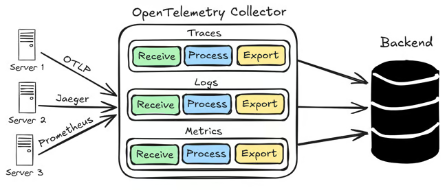
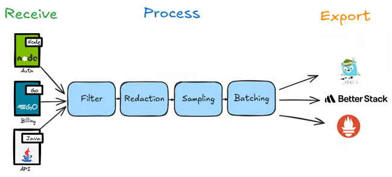
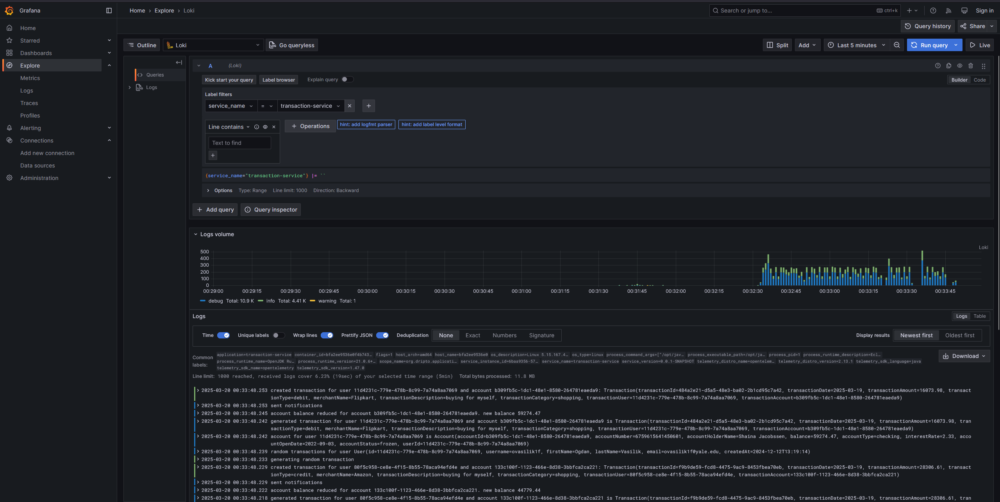

# Observability with OpenTelemetry and Grafana stack
## Part-1: Setting up the services to observe

This is the first part of the series of articles on Observability with OpenTelemetry and Grafana stack. In this series, we will be setting up a full-fledged observability stack to monitor the services in a simulated distributed system.

# Objective
This endeavour has two main objectives:
1. To set up a full-fledged observability stack to monitor the services in a simulated distributed system in that can run in a local environment.
2. Testing the performance impact of the observability stack on the services under observation when the services are under load.

# The components of the stack
The stack will include the following components:
* **services**: A set of services that will be monitored. The services are standard kotlin based Spring Boot applications with a REST API.
Services are supported by a `PostgreSQL` database, built with `Gradle` and instrumented with `OpenTelemetry` Java agent. There are four services in total emulating a simple banking system.
These services are access controlled by a authorization server(also a spring boot application) which acts as a gateway to the services.
* **OpenTelemetry Collector**: The OpenTelemetry Collector is a vendor-agnostic implementation of the OpenTelemetry specification. It is designed to receive, process, and export telemetry data.
This will be used to collect the telemetry data from the services and export it to the monitoring backends.
* **Loki**: Loki is a horizontally-scalable, highly-available, multi-tenant log aggregation system inspired by Prometheus. 
* **Mimir**: Mimir is prometheus compatible metrics store for high availability, multi-tenancy, durable storage, and blazing fast query performance over long periods of time.
* **Tempo**: Tempo is an open source, easy-to-use, and high-scale distributed tracing backend. 
* **Grafana**: Grafana is used for visualizing the data from the services and monitoring backends. It will be used to create dashboards to visualize the metrics and traces.
* **K6**: K6 is a load testing tool that will be used to generate load on the services. 
* **Infrastructure**: The services and monitoring backends will be running in simple local docker containers via compose file.

# The services

There are four services in total emulating a simple banking system. They are simple Kotlin based Spring Boot applications with a REST API with a PostgreSQL database as the backend. The services are instrumented with OpenTelemetry Java agent to collect the telemetry data.

The services are:
* **user-service**: This service is responsible for managing the users in the system. In our very simple banking system, the user-service only has the API to get the users.
The predefined users are loaded in the database when the service starts.
* **account-service**: This service is responsible for managing the accounts in the system. The predefined accounts are loaded in the database when the service starts.
* **notification-service**: This service is responsible for sending notifications to the users.
* **transaction-service**: This service is responsible for managing the transactions in the system.

Along with the services, there is an authorization server that acts as a gateway. This auth-server is responsible for authenticating the requests to the services via Oauth2-JWT tokens.

## Setting up the skeleton

* First, lets create the empty repo/directory for the entire project. 
* Create the `application` directory. All the services will be in this directory.
* Create the empty service directories under the `application` directory. The services are `account-service`, `notification-service`, `transaction-service`, `user-service`, and `auth-server`.
* Create a `shared` directory under the `application` directory. This directory will contain the shared code and configurations for the services and will act as a library for the services.
* The services should be independent of each other and should be able to run in isolation. But they should at least be able to build together. Therefore, define the `settings.gradle.kts` file in the root of the repo and include the services in it.
```kotlin
rootProject.name = "local-observability-opentelemetry-grafana"

include(
    "account-service",
    "notification-service",
    "transaction-service",
    "user-service",
    "shared",
    "auth-server"
)

project(":account-service").projectDir = file("application/account-service")
project(":user-service").projectDir = file("application/user-service")
project(":transaction-service").projectDir = file("application/transaction-service")
project(":notification-service").projectDir = file("application/notification-service")
project(":shared").projectDir = file("application/shared")
project(":auth-server").projectDir = file("application/auth-server")
```
* Let's create an empty `Dockerfile` and compose file (`compose.yaml`) for the repo in the root directory. These files will be used to build and run the services and monitoring backends later.

## Setting up the services
Lets start by setting up the `user-service`. The other services will be extremely similar to this one.

* `user-service` is a simple spring boot application. So create the `build.gradle.kts` file in the `user-service` directory and populate it will required dependencies.
```kotlin
plugins {
    kotlin("jvm") version "2.1.10"
    kotlin("plugin.spring") version "2.1.10"
    id("org.springframework.boot") version "3.4.3"
    id("io.spring.dependency-management") version "1.1.7"
    kotlin("plugin.jpa") version "2.1.10"
}

group = "org.dripto"
version = "0.0.1-SNAPSHOT"

java {
    toolchain {
        languageVersion = JavaLanguageVersion.of(21) // All of our services will be using Java 21
    }
}

repositories {
    mavenCentral()
}

dependencies {
    implementation("org.springframework.boot:spring-boot-starter-data-jpa")
    implementation("org.springframework.boot:spring-boot-starter-web")
    implementation("com.fasterxml.jackson.module:jackson-module-kotlin")
    implementation("org.springframework.boot:spring-boot-starter-oauth2-resource-server") // For Oauth2 resource server
    implementation("com.fasterxml.jackson.datatype:jackson-datatype-hibernate6")
    implementation(project(":shared")) // shared library
    implementation("org.jetbrains.kotlin:kotlin-reflect")
    implementation("org.springframework.boot:spring-boot-starter-actuator")
    runtimeOnly("io.micrometer:micrometer-registry-prometheus") // Actuator and micrometer for exposing metrics
    runtimeOnly("org.postgresql:postgresql")
    implementation("org.liquibase:liquibase-core") // Liquibase for setting up the database
}

kotlin {
    compilerOptions {
        freeCompilerArgs.addAll("-Xjsr305=strict")
    }
}

allOpen {
    annotation("jakarta.persistence.Entity")
    annotation("jakarta.persistence.MappedSuperclass")
    annotation("jakarta.persistence.Embeddable")
}

tasks.withType<Test> {
    useJUnitPlatform()
}

// We are disabling the jar task because we don't want to create the `plain` jar. We will only use the `bootJar` task to create the executable jar.
tasks {
    bootJar {
        enabled = true
    }
    jar {
        enabled = false
    }
}
```
* Create the `application.yaml` file in the `user-service/src/main/resources` directory. This file will contain the configurations for the service.
```yaml
spring:
  application:
    name: user-service
  datasource:
    url: jdbc:postgresql://localhost:5432/postgres # we will setup the database in a docker container later.
    username: postgres
    password: password
  liquibase:
    change-log: classpath:/db/changelog/db.changelog-master.yaml 
    default-schema: user_data
  jpa:
    hibernate:
      ddl-auto: none
    properties:
      hibernate:
        format_sql: false
        show_sql: false
        default_schema: user_data # schema for the user data. We will create this schema in the database later.
  security:
    oauth2:
      resourceserver:
        jwt:
          jwk-set-uri: http://auth-server:9090/oauth2/jwks # auth-server is the auth server that will authenticate the requests to the services. We will setup the auth-server later. Here, we are telling the service to use the jwks uri of the auth-server to validate the jwt tokens.
# enable actuator endpoints
management:
  metrics:
    tags:
      application: ${spring.application.name} # required tag for the metrics
  endpoints:
    web:
      exposure:
        include: "*" # expose all the actuator endpoints
  endpoint:
    health:
      show-details: always
logging:
  pattern:
    level: "trace_id=%mdc{trace_id} span_id=%mdc{span_id} trace_flags=%mdc{trace_flags} %5p"
  level:
    root: info
    org.dripto.application.service: debug
```
* Create the liquibase [changelog file](https://github.com/driptaroop/local-observability-opentelemetry-grafana/blob/main/application/user-service/src/main/resources/db/changelog/db.changelog-master.yaml) `db.changelog-master.yaml` in the `user-service/src/main/resources/db/changelog` directory. This file will contain the liquibase changesets to setup the database.
For this simple example, we will only have 2 changesets. One with the [table DDL](https://raw.githubusercontent.com/driptaroop/local-observability-opentelemetry-grafana/refs/heads/main/application/user-service/src/main/resources/db/changelog/schema_01.sql) 
and another with [the data](https://raw.githubusercontent.com/driptaroop/local-observability-opentelemetry-grafana/refs/heads/main/application/user-service/src/main/resources/db/changelog/data_01.sql).
* Code the entity, controller, and config classes for the `user-service`. 
```kotlin
// App.kt
package org.dripto.application.service.user

import com.fasterxml.jackson.datatype.hibernate6.Hibernate6Module
import org.springframework.boot.autoconfigure.SpringBootApplication
import org.springframework.boot.runApplication
import org.springframework.context.annotation.Bean
import org.springframework.security.config.Customizer
import org.springframework.security.config.annotation.web.builders.HttpSecurity
import org.springframework.security.web.SecurityFilterChain

@SpringBootApplication
class App {
    @Bean
    fun hibernate6Module() = Hibernate6Module()

    @Bean
    fun securityFilterChain(http: HttpSecurity): SecurityFilterChain =
        http.authorizeHttpRequests {
            it.requestMatchers("/actuator/**").permitAll()
            it.anyRequest().authenticated()
        }
            .oauth2ResourceServer { it.jwt(Customizer.withDefaults()) }
            .build()
}

fun main(args: Array<String>) {
    runApplication<App>(*args)
}

// User.kt
package org.dripto.application.service.user

import jakarta.persistence.Column
import jakarta.persistence.Entity
import jakarta.persistence.Id
import jakarta.persistence.Table
import org.springframework.data.jpa.repository.JpaRepository
import org.springframework.data.jpa.repository.Query
import java.time.LocalDateTime
import java.util.UUID

@Entity
@Table(name = "user_data")
class User(
    @Id
    val id: UUID,
    val username: String,
    @Column(name = "first_name")
    val firstName: String,
    @Column(name = "last_name")
    val lastName: String,
    val email: String,
    @Column(name = "created_at")
    val createdAt: LocalDateTime
)

interface UserRepository: JpaRepository<User, UUID> {
    @Query("SELECT u FROM User u WHERE u.username = :username")
    fun getByUsername(username: String): User?
}

// UserController.kt
package org.dripto.application.service.user

import org.dripto.application.service.utils.log
import org.springframework.web.bind.annotation.GetMapping
import org.springframework.web.bind.annotation.PathVariable
import org.springframework.web.bind.annotation.RestController
import java.util.UUID

@RestController
class UserController (private val userRepository: UserRepository) {
    @GetMapping("/users")
    fun getUsers(): List<User> {
        log.info("Getting all users")
        return userRepository.findAll().also {
            log.debug("Found all users: {}", it)
        }
    }

    @GetMapping("/users/{id}")
    fun getUserById(@PathVariable id: UUID): User {
        log.info("Getting user by id: {}", id)
        return userRepository.getReferenceById(id).also {
            log.debug("Found user for id {}: {}", id, it)
        }
    }
}
```

Rest of the services will be similar to the `user-service`. We will also setup the `shared` library to contain the shared rest clients and configurations for the services.
The rest clients are written with Spring Http interfaces over `RestClient`.

## Setting up the Auth server
The auth server is a simple spring boot application that will authenticate the requests to the services via Oauth2-JWT tokens.

* The setup of the auth server is similar to the services. Create the `build.gradle.kts` file in the `auth-server` directory and populate it with the required dependencies.
```kotlin
plugins {
    kotlin("jvm") version "2.1.10"
    kotlin("plugin.spring") version "2.1.10"
    id("org.springframework.boot") version "3.4.3"
    id("io.spring.dependency-management") version "1.1.7"
}

group = "org.dripto.benchmark"
version = "0.0.1-SNAPSHOT"

java {
    toolchain {
        languageVersion = JavaLanguageVersion.of(21)
    }
}

repositories {
    mavenCentral()
}

dependencies {
    implementation("org.springframework.boot:spring-boot-starter-oauth2-authorization-server") // we need this dependency to create the auth server using Spring Authorization Server framework
    implementation("org.springframework.boot:spring-boot-starter-web")
    implementation("org.springframework.boot:spring-boot-starter-actuator")
    implementation("com.fasterxml.jackson.module:jackson-module-kotlin")
    implementation("org.jetbrains.kotlin:kotlin-reflect")
    implementation("org.springframework.boot:spring-boot-starter-actuator")
    runtimeOnly("io.micrometer:micrometer-registry-prometheus")
}

kotlin {
    compilerOptions {
        freeCompilerArgs.addAll("-Xjsr305=strict")
    }
}

tasks.withType<Test> {
    useJUnitPlatform()
}

tasks {
    bootJar {
        enabled = true
    }
    jar {
        enabled = false
    }
}
```
* Create the `application.yaml` file in the `auth-server/src/main/resources` directory. 
```yaml
server:
  port: 9090
spring:
  application:
    name: auth-server
management:
  endpoints:
    web:
      exposure:
        include: "*"
  endpoint:
    health:
      show-details: always
  metrics:
    tags:
      application: ${spring.application.name}
```
* Create the security configuration and the client registration configuration for the auth server.
```kotlin
package org.dripto.application.service.auth

import com.nimbusds.jose.jwk.JWKSet
import com.nimbusds.jose.jwk.RSAKey
import com.nimbusds.jose.jwk.source.ImmutableJWKSet
import com.nimbusds.jose.jwk.source.JWKSource
import com.nimbusds.jose.proc.SecurityContext
import org.springframework.boot.autoconfigure.SpringBootApplication
import org.springframework.boot.runApplication
import org.springframework.context.annotation.Bean
import org.springframework.core.annotation.Order
import org.springframework.security.config.Customizer
import org.springframework.security.config.annotation.web.builders.HttpSecurity
import org.springframework.security.oauth2.core.AuthorizationGrantType
import org.springframework.security.oauth2.core.ClientAuthenticationMethod
import org.springframework.security.oauth2.jwt.JwtDecoder
import org.springframework.security.oauth2.server.authorization.OAuth2TokenType
import org.springframework.security.oauth2.server.authorization.client.InMemoryRegisteredClientRepository
import org.springframework.security.oauth2.server.authorization.client.RegisteredClient
import org.springframework.security.oauth2.server.authorization.client.RegisteredClientRepository
import org.springframework.security.oauth2.server.authorization.config.annotation.web.configuration.OAuth2AuthorizationServerConfiguration
import org.springframework.security.oauth2.server.authorization.config.annotation.web.configurers.OAuth2AuthorizationServerConfigurer
import org.springframework.security.oauth2.server.authorization.token.JwtEncodingContext
import org.springframework.security.oauth2.server.authorization.token.OAuth2TokenCustomizer
import org.springframework.security.web.SecurityFilterChain
import java.security.KeyPair
import java.security.KeyPairGenerator
import java.security.interfaces.RSAPrivateKey
import java.security.interfaces.RSAPublicKey
import java.util.*

@SpringBootApplication
class App {

    @Bean
    fun standardSecurityFilterChain(http: HttpSecurity): SecurityFilterChain {
        return http.with(OAuth2AuthorizationServerConfigurer.authorizationServer(), Customizer.withDefaults())
            .authorizeHttpRequests {
                it.requestMatchers("/actuator/**").permitAll()
                it.anyRequest().authenticated()
            }
            .formLogin { it.disable() }
            .csrf { it.disable() }.build()
    }

    // creating the clients for the services and k6
    @Bean
    fun registeredClientRepository(): RegisteredClientRepository {
        val k6 = createClient("k6")
        val accountService = createClient("account-service")
        val userService = createClient("user-service")
        val notificationService = createClient("notification-service")
        val transactionService = createClient("transaction-service")
        return InMemoryRegisteredClientRepository(k6, accountService, userService, notificationService, transactionService)
    }

    @Bean
    fun jwkSource(): JWKSource<SecurityContext> {
        val keyPair: KeyPair = KeyPairGenerator.getInstance("RSA").apply { initialize(2048) }.genKeyPair()
        val publicKey = keyPair.public as RSAPublicKey
        val privateKey = keyPair.private as RSAPrivateKey
        val rsaKey = RSAKey.Builder(publicKey)
            .privateKey(privateKey)
            .keyID(UUID.randomUUID().toString())
            .build()
        val jwkSet = JWKSet(rsaKey)
        return ImmutableJWKSet(jwkSet)
    }

    @Bean
    fun jwtDecoder(jwkSource: JWKSource<SecurityContext>): JwtDecoder {
        return OAuth2AuthorizationServerConfiguration.jwtDecoder(jwkSource)
    }

    @Bean
    fun tokenCustomizer(): OAuth2TokenCustomizer<JwtEncodingContext> {
        return OAuth2TokenCustomizer { context ->
            if (OAuth2TokenType.ACCESS_TOKEN == context.tokenType) {
                // Add custom claim to the access token
                context.claims.claim("hello1", "world1")
            }
        }
    }

    private fun createClient(client: String): RegisteredClient = RegisteredClient.withId(client)
        .clientId(client)
        .clientSecret("{noop}$client-secret")
        .clientAuthenticationMethod(ClientAuthenticationMethod.CLIENT_SECRET_BASIC)
        .authorizationGrantType(AuthorizationGrantType.CLIENT_CREDENTIALS)
        .scope("local")
        .build()
}

fun main(args: Array<String>) {
    runApplication<App>(*args)
}
```

# OpenTelemetry And Java agent instrumentation

## What is Observability?
Observability lets you understand a system from the outside by letting you ask questions about that system without knowing its inner workings. 
Furthermore, it allows you to easily troubleshoot and handle novel problems, that is, “unknown unknowns”. It also helps you answer the question 
“Why is this happening?”

To ask those questions about your system, your application must be properly instrumented. That is, the application code must 
emit signals such as traces, metrics, and logs. An application is properly instrumented when developers don’t need to add more instrumentation to 
troubleshoot an issue, because they have all of the information they need.

`OpenTelemetry` is the mechanism by which application code is instrumented to help make a system observable. [[sic]](https://opentelemetry.io/docs/concepts/observability-primer/#what-is-observability)

## What is OpenTelemetry? 
* `OpenTelemetry` is an open-source observability framework that provides APIs, SDKs, and tools for instrumenting, generating, 
and collecting telemetry data such as traces, metrics, and logs. Originally born from the merger of OpenTracing and OpenCensus, OpenTelemetry 
has become the de facto standard for collecting telemetry data in modern cloud-native applications.
* `OpenTelemetry` supports collecting the 3 pillars of observability: traces, metrics, and logs. Additionally, it also adds experimental support for the 4th pillar: Profiling.

## What are the benefits of `OpenTelemetry`?
* **Standardization Across Observability Pillars**: Observability consists of three core pillars:
  * Tracing: Understanding request flows across distributed systems. 
  * Metrics: Capturing quantitative system health indicators. 
  * Logging: Storing event details for debugging and forensic analysis.
  
  `OpenTelemetry` provides a unified API for all three, ensuring consistency across different observability tools and vendors. Additionally, OpenTelemetry also includes experimental support for profiling, which can provide insights into application performance bottlenecks.

* **Vendor-Agnostic & Open Source** : Traditional APM (Application Performance Monitoring) solutions often lock users into proprietary ecosystems. OpenTelemetry, being open-source and vendor-neutral, allows organizations to choose their backend (e.g., Prometheus, Jaeger, Zipkin, Datadog) without rewriting instrumentation code.
* **Seamless Integration with Cloud-Native Ecosystem** : `OpenTelemetry` integrates seamlessly with Kubernetes, Istio, Envoy, AWS X-Ray, Azure Monitor, and other cloud-native services, making it ideal for microservices architectures.
* **Automatic and Manual Instrumentation** :
  * _Auto-Instrumentation_: Many popular libraries (e.g., Spring Boot, Django, Express.js) support automatic telemetry data collection, reducing engineering effort. 
  * _Manual Instrumentation_: Developers can customize instrumentation when deeper visibility is required.
* **Enhanced Debugging & Faster MTTR** : With distributed tracing capabilities, `OpenTelemetry` enables developers to:
  * Identify performance bottlenecks. 
  * Pinpoint root causes in complex call chains. 
  * Reduce MTTR (Mean Time to Resolution) by quickly correlating logs, metrics, and traces.
* **Future-Proof & Cloud-Native First** : As an open-source project under the CNCF (Cloud Native Computing Foundation), `OpenTelemetry` is rapidly evolving with strong community support. It is designed for serverless, containerized, and microservices-based architectures.
* **Cost Efficiency** : Since `OpenTelemetry` allows for sampling, aggregation, and intelligent data collection, it reduces storage costs and data ingestion expenses compared to traditional full-fidelity logging solutions.

## Instrumentation using `OpenTelemetry`
For a system to be `observable`, it must be instrumented: that is, code from the system’s components must emit signals, such as traces, metrics, and logs.
There are 2 ways to instrument a system or application using `OpenTelemetry`:
* **Code Based Instrumentation**: This way allows you to get deeper insight and rich telemetry from your application itself. You can use the OpenTelemetry SDKs (available for different programming languages) 
to instrument your application code. 
* **Zero-code Instrumentation**: Zero Code Instrumentation is a way to instrument your application without modifying the application code. This is great for getting started, or when you 
can’t modify the application you need to get telemetry out of. They provide rich telemetry from libraries you use and/or the environment your application runs in. Another way to think of it is that they 
provide information about what’s happening at the edges of your application. There are multiple ways to do zero-code instrumentation for different languages... for Java, the most common way is to use the `OpenTelemetry Java Agent` and
this is what we will be using in our services.


# Instrumenting the services with OpenTelemetry Java agent
Back to our services, we will be using the `OpenTelemetry Java agent` to instrument the services. 
A java agent is just a specially crafted jar file. It utilizes the Instrumentation API that the JVM provides to alter existing byte-code that is loaded in a JVM.
In this case, the OpenTelemetry Java agent will be used to add the necessary instrumentation to the services to collect the telemetry data without modifying the application code.
Once downloaded, the agent jar file can be used with the `-javaagent` JVM argument to instrument the services.

To use the OpenTelemetry Java agent, we need to first download the agent jar file. The agent jar file can be downloaded from the [opentelemetry-java-instrumentation releases page](https://github.com/open-telemetry/opentelemetry-java-instrumentation/releases/).
We download the latest version of the agent jar file and place it in the root directory of the repo with the name `opentelemetry-javaagent.jar`.

Next, we need to add the `-javaagent` JVM argument to the services to use the agent. Since we will be running the services in docker containers, we can do it there.
Let's write a simple single `Dockerfile` for all the services. We will use a multi-stage build to build the services and then run all services as separate targets with the OpenTelemetry Java agent.

```dockerfile
# Builder stage
FROM eclipse-temurin:21-alpine AS builder

WORKDIR /app
COPY . .
COPY ca.crt /usr/local/share/ca-certificates/all-ca-certs.crt # If you have any custom CA certificates, you can add them here. We will use this to trust the certificates in the services. Ignore if not needed.

RUN chmod 644 /usr/local/share/ca-certificates/all-ca-certs.crt && update-ca-certificates
RUN keytool -importcert -trustcacerts -cacerts -file /usr/local/share/ca-certificates/all-ca-certs.crt -alias all-ca-certs -storepass changeit -noprompt

RUN ./gradlew build

# user-service
FROM eclipse-temurin:21-alpine AS user-service

WORKDIR /app

EXPOSE 8080
COPY --from=builder /app/application/user-service/build/libs/*.jar /app.jar
COPY opentelemetry-javaagent.jar ./otel.jar

ENTRYPOINT ["java", "-javaagent:/app/otel.jar", "-jar", "/app.jar"]

# notification-service
FROM eclipse-temurin:21-alpine AS notification-service

WORKDIR /app

EXPOSE 8080
COPY --from=builder /app/application/notification-service/build/libs/*.jar /app.jar
COPY opentelemetry-javaagent.jar ./otel.jar

ENTRYPOINT ["java", "-javaagent:/app/otel.jar", "-jar", "/app.jar"]

# account-service
FROM eclipse-temurin:21-alpine AS account-service

WORKDIR /app

EXPOSE 8080
COPY --from=builder /app/application/account-service/build/libs/*.jar /app.jar
COPY opentelemetry-javaagent.jar ./otel.jar

ENTRYPOINT ["java", "-javaagent:/app/otel.jar", "-jar", "/app.jar"]

# transaction-service
FROM eclipse-temurin:21-alpine AS transaction-service

WORKDIR /app

EXPOSE 8080
COPY --from=builder /app/application/transaction-service/build/libs/*.jar /app.jar
COPY opentelemetry-javaagent.jar ./otel.jar

ENTRYPOINT ["java", "-javaagent:/app/otel.jar", "-jar", "/app.jar"]

# auth-server
FROM eclipse-temurin:21-alpine AS auth-server

WORKDIR /app

EXPOSE 9090
COPY --from=builder /app/application/auth-server/build/libs/*.jar /app.jar
COPY opentelemetry-javaagent.jar ./otel.jar

ENTRYPOINT ["java", "-javaagent:/app/otel.jar", "-jar", "/app.jar"]
```

> NOTE: In the `Dockerfile`, I am adding a custom CA certificate to the truststore of the JVM. This is needed if the services are making requests to services with self-signed certificates. Ignore that part if not needed.

Now, we can build and run the services with the OpenTelemetry Java agent. The services will be running in docker containers and will be instrumented with the OpenTelemetry Java agent to collect the telemetry data.
Now its time to run the services and the auth server in docker containers.

# Running the services and the auth server in docker compose
We will be running the services and the auth server in docker containers using docker compose. This is where we will also setup the database along with the services.
Let's create the `compose.yaml` file in the root directory of the repo.

```yaml
x-common-env-services: &common-env-services # we will use this anchored extension section to set the common environment variables for all the services.
  SPRING_DATASOURCE_URL: jdbc:postgresql://db-postgres:5432/postgres
  SPRING_DATASOURCE_USERNAME: postgres
  SPRING_DATASOURCE_PASSWORD: password
x-common-services-build: &common-services-build # we will use this anchored extension section to set the common build configurations for all the services.
  context: .
  dockerfile: Dockerfile
services:
  db-postgres:
    image: postgres:17
    environment:
      POSTGRES_USER: postgres
      POSTGRES_PASSWORD: password
      POSTGRES_DB: postgres
    ports:
      - "5432:5432"
    volumes:
      - ./init.sql:/docker-entrypoint-initdb.d/init.sql # we will use this sql file to create the schemas in the database.
    deploy:
      resources:
        limits:
          cpus: 1
          memory: 1G
    profiles:
      - db
      - services
  auth-server:
    build:
      <<: *common-services-build
      target: auth-server
    ports:
      - "9090:9090"
    environment:
      <<: *common-env-services
      OTEL_SERVICE_NAME: auth-server
      OTEL_RESOURCE_ATTRIBUTES: "application=auth-server"
    profiles:
      - services
  user-service:
    build:
      <<: *common-services-build
      target: user-service
    environment:
      <<: *common-env-services
      OTEL_SERVICE_NAME: user-service
      OTEL_RESOURCE_ATTRIBUTES: "application=user-service"
    depends_on:
      - db-postgres
      - auth-server
    profiles:
      - services
  account-service:
    build:
      <<: *common-services-build
      target: account-service
    environment:
      <<: *common-env-services
      OTEL_SERVICE_NAME: account-service
      OTEL_RESOURCE_ATTRIBUTES: "application=account-service"
    depends_on:
      - user-service
    profiles:
      - services
  notification-service:
    build:
      <<: *common-services-build
      target: notification-service
    environment:
      <<: *common-env-services
      OTEL_SERVICE_NAME: notification-service
      OTEL_RESOURCE_ATTRIBUTES: "application=notification-service"
    depends_on:
      - user-service
    profiles:
      - services
  transaction-service:
    build:
      <<: *common-services-build
      target: transaction-service
    ports:
      - "8080:8080"
    environment:
      <<: *common-env-services
      OTEL_SERVICE_NAME: transaction-service
      OTEL_RESOURCE_ATTRIBUTES: "application=transaction-service"
    depends_on:
      - notification-service
      - account-service
    profiles:
      - services
```

In the compose file, we are setting up the `db-postgres`, `auth-server`, `user-service`, `account-service`, `notification-service`, and `transaction-service` services.
Since the services has a lot in common, we are using the anchored extension sections to set the common environment variables and build configurations for all the services.
We also define different profiles for the services. The `db` profile is for the `db-postgres` service and the `services` profile is for the services. We will use it later on. 
For now, ignore the profiles.

We are also setting up the `db-postgres` service to run the PostgreSQL database. We will be using the `init.sql` file to create the schemas in the database.
Let's create the `init.sql` file in the root directory of the repo.

```sql
create schema if not exists user_data;
create schema if not exists accounts_data;
create schema if not exists notifications_data;
create schema if not exists transactions_data;
```

## Start the services

Now we have a separation of schemas in the database for different services. We can now run the services and the auth server in docker containers using the compose file.

```bash
docker compose  --profile "*" up
```

The services will be running in docker containers and will be instrumented with the OpenTelemetry Java agent to collect the telemetry data. 
You will see a lot of errors in the logs because the open telemetry agent, even though is running and capturing the telemetry data, has nowhere to send it.

In the next part, we will setup the OpenTelemetry Collector to collect the telemetry data from the services and export it to the monitoring backends.

# Setting up log aggregation with Loki, Grafana, and OpenTelemetry Collector
Now we are in the thick of things. We have the services running in docker containers and are instrumented with the OpenTelemetry Java agent to collect the telemetry data.
In this part, we will setup the log aggregation with Loki, Grafana, and OpenTelemetry Collector.

# OpenTelemetry Collector
The OpenTelemetry Collector is one of the core components of the OpenTelemetry observability stack. It is a vendor-agnostic neutral intermediary for collecting, processing, and forwarding telemetry signals (traces, metrics, and logs) to an observability backend. 

Its primary goal is to simplify observability architectures by removing the need to deploy multiple telemetry agents. Instead, the Collector consolidates diverse telemetry signals into a single, unified solution, significantly reducing complexity and overhead.
Beyond simplification, the Collector provides a robust abstraction layer between your applications and observability platforms. This separation grants flexibility, allowing seamless integration with various backends without altering application instrumentation.

The Collector natively supports the OpenTelemetry Protocol (`OTLP`), but it also integrates effortlessly with open source observability data formats like Jaeger, Prometheus, Fluent Bit, and others. Its vendor-neutral architecture ensures compatibility with a broad range of open-source and commercial observability solutions.

## Benefits of using OpenTelemetry Collector
* **Unified Telemetry Collection**: Consolidates traces, metrics, and logs into a single collection point, simplifying deployment and management.
* **Reduced Complexity**: Eliminates the need for multiple telemetry agents, significantly streamlining observability infrastructure.
* **Flexibility and Abstraction**: Provides an abstraction layer between applications and observability backends, enabling seamless integration without altering application instrumentation.
* **Vendor-Neutral Integration**: Supports the OpenTelemetry Protocol (OTLP) and popular telemetry formats like Jaeger, Prometheus, and Fluent Bit, allowing interoperability with diverse backend solutions.
* **Extensibility**: Highly customizable through user-defined components, facilitating adaptation to specialized requirements and advanced use cases such as filtering and batching.
* **Cost Efficiency**: Reduces operational overhead by consolidating agents and optimizing telemetry data processing.
* **Open Source and Community-Driven**: Built on Go and licensed under Apache 2.0, benefiting from continuous enhancements by a vibrant open-source community.

## How does OpenTelemetry Collector work?


From a high level, open telemetry collector is a collection of several pipelines. Each pipeline represents a different type of telemetry signal (traces, metrics, logs) and consists of several parts like receivers, processors, and exporters.

* **Receivers**: Receivers are responsible data reception. They ingest telemetry data from various sources. It collects telemetry data from a variety of sources, including instrumented applications, agents, and other collectors. This is done through `receiver` components.
* **Processors**: Processors are responsible for transforming and enriching telemetry data. They can be used to filter, aggregate, or enhance telemetry data before it is exported. This is done through `processor` components.
* **Exporters**: Exporters are responsible for sending telemetry data to a backend system, such as observability platforms, databases, or cloud services for purposes such as tracing systems, metric stores, and log aggregators. This is done through `exporter` components.

By combining receivers, processors, and exporters in the Collector configuration, you can create pipelines which serve as a separate processing lane for logs, traces, or metrics. Different combinations of receivers, processors, and exporters can be used to create simple but powerful pipelines that meet your specific observability requirements.


> NOTE: There are also `Connector` components can also link one pipeline's output to another's input allowing you to use the processed data from one pipeline as the starting point for another. This enables more complex and interconnected data flows within the Collector.

## OpenTelemetry Collector Flavors
There are 2 flavors of the OpenTelemetry Collector: `core` and `contrib`.
* _Core_: This contains only the most essential components along with frequently used extras like filter and attribute processors, and popular exporters such as Prometheus, Kafka, and others. It's distributed under the `otelcol` binary.
* _Contrib_: This is the comprehensive version, including almost everything from both the `core` and `contrib` repositories, except for components that are still under development. It's distributed under the `otelcol-contrib` binary. This is the one we will be using.

# Setting up OpenTelemetry Collector

## Setting up the OpenTelemetry Collector configuration
We will be using the `contrib` version of the OpenTelemetry Collector. otel collector uses a configuration file to setup the pipelines. Let's create the config file for the collector in the new directory called `config/otel` and name it `otel.yaml`.

```yaml
receivers:
  otlp:
      protocols:
        http:
          endpoint: "0.0.0.0:4318"
processors:
  batch:

exporters:
  otlphttp/loki:
    endpoint: http://loki:3100/otlp # loki is the loki service running in the same docker network. We will setup the loki service later.

service:
  pipelines:
    logs:
      receivers: [otlp]
      processors: [batch]
      exporters: [otlphttp/loki]
```

In this otel config file, we are setting up the otel collector pipeline(s). So far the only pipeline we configured is the logs pipeline. 
1. We are using the `otlp` receiver to receive the logs from the services. This logs are exported from the services in the `OTLP` format by the OpenTelemetry Java agent. The otlp receiver can receive information over gRPC or HTTP. We are using the HTTP protocol.
We are creating an endpoint on which the receiver will listen for the instrumented services to send the data.
2. We are using the `batch` processor to batch the logs before exporting them. 
3. We are using the `otlphttp/loki` exporter to export the logs to the loki service running in the same docker network. Loki is fully compatible with OTLP and can receive logs in the OTLP format over HTTP.
4. Finally, we are setting up the `logs` pipeline with the `otlp` receiver, `batch` processor, and `otlphttp/loki` exporter creating a single processing lane for logs.

We can now add the otel collector service to the compose file.

```yaml
    otel-collector:
      image: otel/opentelemetry-collector-contrib:0.120.0
      volumes:
        - ./config/otel/otel.yaml:/etc/config.yaml
      command:
        - "--config=/etc/config.yaml"
      profiles:
        - otel
```

We have to edit the services compose definition to add the otel collector endpoint so that the otel Java Agent knows where to send the telemetry data. Since we are using anchored extension sections, we can easily add the otel collector endpoint to all the services 
by adding the `OTEL_EXPORTER_OTLP_ENDPOINT` environment variable to the `x-common-env-services` anchored extension section.

```yaml
x-common-env-services: &common-env-services
  SPRING_DATASOURCE_URL: jdbc:postgresql://db-postgres:5432/postgres
  SPRING_DATASOURCE_USERNAME: postgres
  SPRING_DATASOURCE_PASSWORD: password
  OTEL_EXPORTER_OTLP_ENDPOINT: "http://otel-collector:4318"
  OTEL_LOGS_EXPORTER: otlp
```

# Loki
Now that the application is sending the logs to the OpenTelemetry Collector via the OpenTelemetry Java agent, we need to setup the log aggregation backend to store and query the logs so that the open telemetry collector can export the logs to it.
We will be using Loki for this purpose. Loki is a horizontally-scalable, highly-available, multi-tenant log aggregation system inspired by Prometheus. It is designed to be very cost-effective and easy to operate, as it does not index the contents of the logs, but rather a set of labels for each log stream.

## Setting up Loki
Loki needs a configuration file to setup the log aggregation. Let's create the config file for Loki in the new directory called `config/loki` and name it `loki.yaml`.

```yaml
# Disable multi-tenancy, ensuring a single tenant for all log streams.
auth_enabled: false

# Configuration block for the Loki server.
server:
  http_listen_port: 3100  # Listen on port 3100 for all incoming traffic.
  log_level: info         # Set the log level to info.

# The limits configuration block allows default global and per-tenant limits to be set (which can be altered in an
# overrides block). In this case, volume usage is be enabled globally (as there is one tenant).
# This is used by the Logs Explorer app in Grafana.
limits_config:
  volume_enabled: true

# The common block is used to set options for all of the components that make up Loki. These can be overridden using
# the specific configuration blocks for each component.
common:
  instance_addr: 127.0.0.1            # The address at which this Loki instance can be reached on the local hash ring.
  # Loki is running as a single binary, so it's the localhost address.
  path_prefix: /loki                  # Prefix for all HTTP endpoints.
  # Configuration of the underlying Loki storage system.
  storage:
    # Use the local filesystem. In a production environment, you'd use an object store like S3 or GCS.
    filesystem:
      chunks_directory: /loki/chunks  # The FS directory to store the Loki chunks in.
      rules_directory: /loki/rules    # The FS directory to store the Loki rules in.
  replication_factor: 1               # The replication factor (RF) determines how many ingesters will store each chunk.
    # In this case, we have one ingester, so the RF is 1, but in a production system
  # you'd have multiple ingesters and set the RF to a higher value for resilience.
  # The ring configuration block is used to configure the hash ring that all components use to communicate with each other.
  ring:
    # Use an in-memory ring. In a production environment, you'd use a distributed ring like memberlist, Consul or etcd.
    kvstore:
      store: inmemory

# The schema_config block is used to configure the schema that Loki uses to store log data. Loki allows the use of
# multiple schemas based on specific time periods. This allows backwards compatibility on schema changes.
schema_config:
  # Only one config is specified here.
  configs:
    - from: 2020-10-24          # When the schema applies from.
      store: tsdb               # Where the schema is stored, in this case using the TSDB store.
      object_store: filesystem  # As configured in the common block above, the object store is the local filesystem.
      schema: v13               # Specify the schema version to use, in this case the latest version (v13).
      # The index configuration block is used to configure how indexing tables are created and stored. Index tables
      # are the directory that allows Loki to determine which chunks to read when querying for logs.
      index:
        prefix: index_          # Prefix for all index tables.
        period: 24h             # The period for which each index table covers. In this case, 24 hours.

# The ruler configuration block to configure the ruler (for recording rules and alerts) in Loki.
ruler:
  alertmanager_url: http://localhost:9093   # The URL of the Alertmanager to send alerts to. Again, this is a single
  # binary instance running on the same host, so it's localhost.

analytics:
  reporting_enabled: false
```

The details of this config file is fairly complex but in a nutshell, we are setting up Loki to listen on port 3100 for incoming traffic (if you remember, that is the port we were exporting the logs to in the otel collector config). 
We are using the local filesystem to store the logs. In a production environment, you'd use an object store like S3 or GCS. We are also setting up the replication factor to 1. In a production system, you'd have multiple ingesters and set the RF to a higher value for resilience.

We can now add the Loki service to the compose file.

```yaml
  loki:
    image: grafana/loki:3.4.2
    command: [ "--pattern-ingester.enabled=true", "-config.file=/etc/loki/loki.yaml" ]
    volumes:
      - "./config/loki/loki.yaml:/etc/loki/loki.yaml"
    profiles:
      - grafana
```

# Grafana
So now we have a log aggregation system in place. The only thing left is to visualize the logs. We will be using Grafana for this purpose. 

Grafana is a multi-platform open-source analytics and interactive visualization web application. It provides charts, graphs, and alerts for the web when connected to widely supported data sources.

## Setting up Grafana
Grafana needs a configuration file to setup the data sources. Let's create the datasource config file for Grafana in the new directory called `config/grafana` and name it `grafana-datasource.yaml`.

```yaml
apiVersion: 1

datasources:
  - name: Loki
    type: loki
    uid: loki
    access: proxy
    url: http://loki:3100
    basicAuth: false
    isDefault: false
    version: 1
    editable: false
```

In this config file, we are setting up the Loki datasource for Grafana. We are setting the datasource name to `Loki`, the type to `loki`, the url to `http://loki:3100` (if you remember, that is the port Loki is listening on for incoming traffic).

We can now add the Grafana service to the compose file.

```yaml
    grafana:
      image: grafana/grafana:11.5.2
      volumes:
        - "./config/grafana/grafana-datasource.yaml:/etc/grafana/provisioning/datasources/datasources.yaml"
        - "./ca.crt:/etc/ssl/certs/ca-certificates.crt" # If you have any custom CA certificates, you can add them here. We will use this to trust the certificates in the services. Ignore if not needed.
      ports:
        - "3000:3000"
      environment:
        - GF_FEATURE_TOGGLES_ENABLE=flameGraph traceqlSearch correlations traceQLStreaming metricsSummary traceqlEditor traceToMetrics traceToProfiles datatrails # Feature flags to enable some of the features in Grafana that we will need later on.
        - GF_INSTALL_PLUGINS=grafana-lokiexplore-app,grafana-exploretraces-app,grafana-pyroscope-app # Install the plugins for Loki, Explore Traces, and Pyroscope. we wil use them later on for drill down.
        - GF_AUTH_ANONYMOUS_ENABLED=true # Enable anonymous access to Grafana
        - GF_AUTH_ANONYMOUS_ORG_ROLE=Admin # Set the role for the anonymous user
        - GF_AUTH_DISABLE_LOGIN_FORM=true # Disable the login form and log the user in automatically
      depends_on:
        - loki
      profiles:
        - grafana
```

# Start the services
Now that we have log aggregation and visualization in place, we can start the services and the auth server along with the OpenTelemetry Collector, Loki, and Grafana.

```bash
docker compose  --profile "*" up --force-recreate --build
```

Check the logs of the services, the OpenTelemetry Collector, Loki, and Grafana to see if everything is running fine. 

Finally, if everything is running fine, you can access Grafana at `http://localhost:3000`. You will be able to see the logs from the services in the Explore section of Grafana by selecting the `Loki` datasource. You may have to filter by the service name to see the logs from a particular service.

